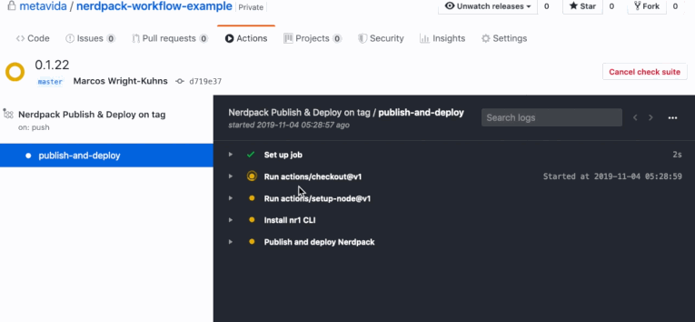

# nerdpack-workflow-example

Using GitHub actions to deploy a Nerdpack to New Relic One.



## Local Development

Running the Nerdpack locally

```
npm install
npm start
```

Visit https://one.newrelic.com/?nerdpacks=local and :sparkles:

## Deploying a change

When you're ready to deploy your local changes for others to use in New Relic One

1. Use `npm version` to bump the version number.
2. Push the version commit to GitHub.
3. Wait until [the Action](https://github.com/metavida/nerdpack-workflow-example/actions) has completed.
4. That's it!

## Creating new artifacts

If you want to create new artifacts run the following command:

```
nr1 create
```

> Example: `nr1 create --type nerdlet --name my-nerdlet`.
